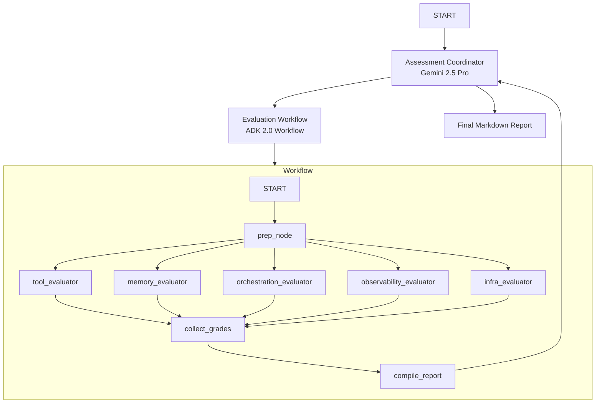

# Grading Agent (Multi-Agent Grading Pipeline)

This project implements a structured multi-agent evaluation workflow using **ADK 2.0**. It is designed to assess input codebases or agent configurations using a parallel fan-out/fan-in design pattern.

## Architecture

The system uses a coordinator-workflow-worker pattern:



### Components

1.  **Assessment Coordinator** (Root Agent):
    *   **Model**: `gemini-2.5-pro`
    *   **Role**: Receives the input (e.g., a codebase URL), routes it to the `evaluation_workflow`, and formats the final `FinalReport` output as a detailed markdown report.

2.  **Evaluation Workflow** (Workflow):
    *   Orchestrates the parallel execution of the evaluators.
    *   **Flow**: `START` -> `prep_node` -> (Parallel Evaluators) -> `collect_grades` (JoinNode) -> `compile_report`.

3.  **Evaluators** (Sub-agents):
    *   **Model**: `gemini-2.5-flash` (single-turn)
    *   **Output Schema**: `CategoryGrade` (contains `score`, `evidence`, and `recovery_instructions`)
    *   **Categories**:
        *   `tool_evaluator`: Evaluates tool docstrings, naming, explicit schemas, and error handling.
        *   `memory_evaluator`: Evaluates system instructions, history compaction, persistent state, and async operations.
        *   `orchestration_evaluator`: Evaluates multi-agent patterns, model routing, guardrails, and human-in-the-loop.
        *   `observability_evaluator`: Evaluates structured logging, outcome capture, tracing, and PII redaction.
        *   `infra_evaluator`: Evaluates automated evaluation suites, IaC, and secret management.

4.  **Helper Nodes**:
    *   `prep_node`: Extracts and prepares the input text.
    *   `compile_report`: Aggregates the `CategoryGrade` outputs, calculates the total score, and returns a `FinalReport` object.

## Project Structure

```
grading-agent/
├── app/         # Core agent code
│   ├── agent.py               # Main agent logic
│   ├── fast_api_app.py        # FastAPI Backend server
│   └── app_utils/             # App utilities and helpers
├── tests/                     # Unit, integration, and load tests
├── GEMINI.md                  # AI-assisted development guide
└── pyproject.toml             # Project dependencies
```

> 💡 **Tip:** Use [Antigravity CLI](https://antigravity.google/) for AI-assisted development - project context is pre-configured in `GEMINI.md`.

## Requirements

Before you begin, ensure you have:
- **uv**: Python package manager (used for all dependency management in this project) - [Install](https://docs.astral.sh/uv/getting-started/installation/) ([add packages](https://docs.astral.sh/uv/concepts/dependencies/) with `uv add <package>`)
- **agents-cli**: Agents CLI - Install with `uv tool install google-agents-cli`
- **Google Cloud SDK**: For GCP services - [Install](https://cloud.google.com/sdk/docs/install)


## Quick Start

Install `agents-cli` and its skills if not already installed:

```bash
uvx google-agents-cli setup
```

Install required packages:

```bash
agents-cli install
```

Test the agent with a local web server:

```bash
agents-cli playground
```

You can also use features from the [ADK](https://adk.dev/) CLI with `uv run adk`.

## Commands

| Command              | Description                                                                                 |
| -------------------- | ------------------------------------------------------------------------------------------- |
| `agents-cli install` | Install dependencies using uv                                                         |
| `agents-cli playground` | Launch local development environment                                                  |
| `agents-cli lint`    | Run code quality checks                                                               |
| `agents-cli eval`    | Evaluate agent behavior (generate, grade, analyze, and more — see `agents-cli eval --help`) |
| `uv run pytest tests/unit tests/integration` | Run unit and integration tests                                                        |
| `agents-cli deploy`  | Deploy agent to Agent Runtime                                                                |
| `agents-cli publish gemini-enterprise` | Register deployed agent to Gemini Enterprise                    || [A2A Inspector](https://github.com/a2aproject/a2a-inspector) | Launch A2A Protocol Inspector                                                        |

## 🛠️ Project Management

| Command | What It Does |
|---------|--------------|
| `agents-cli scaffold enhance` | Add CI/CD pipelines and Terraform infrastructure |
| `agents-cli infra cicd` | One-command setup of entire CI/CD pipeline + infrastructure |
| `agents-cli scaffold upgrade` | Auto-upgrade to latest version while preserving customizations |

---

## Development

Edit your agent logic in `app/agent.py` and test with `agents-cli playground` - it auto-reloads on save.

## Deployment

```bash
gcloud config set project <your-project-id>
agents-cli deploy
```

To add CI/CD and Terraform, run `agents-cli scaffold enhance`.
To set up your production infrastructure, run `agents-cli infra cicd`.

## Observability

Built-in telemetry exports to Cloud Trace, BigQuery, and Cloud Logging.

## A2A Inspector

This agent supports the [A2A Protocol](https://a2a-protocol.org/). Use the [A2A Inspector](https://github.com/a2aproject/a2a-inspector) to test interoperability.
See the [A2A Inspector docs](https://github.com/a2aproject/a2a-inspector) for details.
